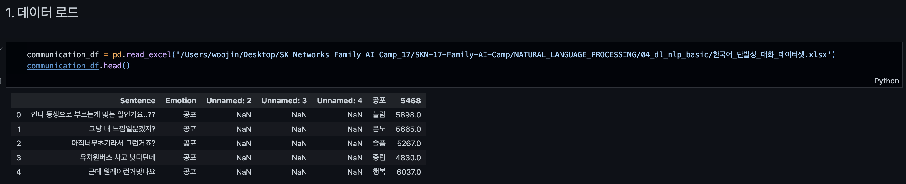
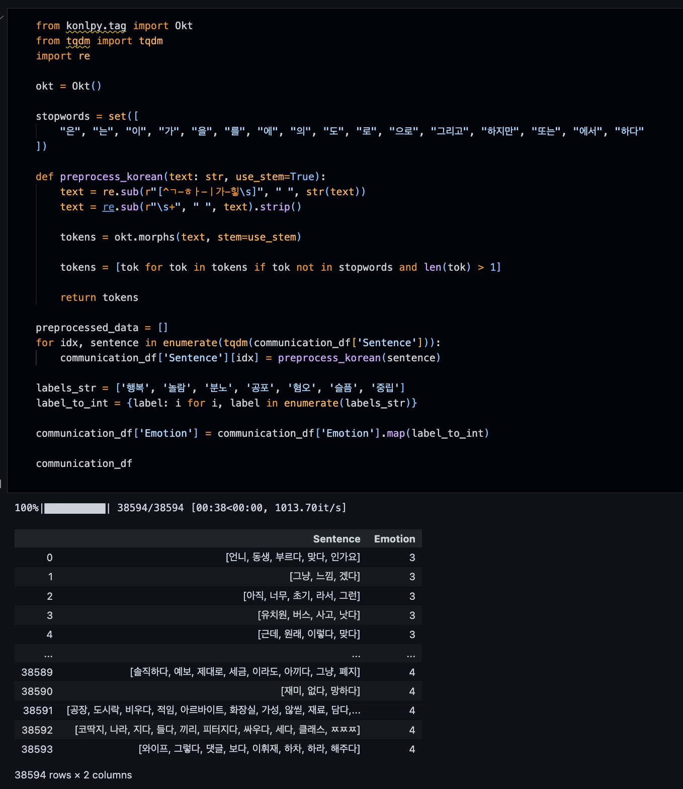
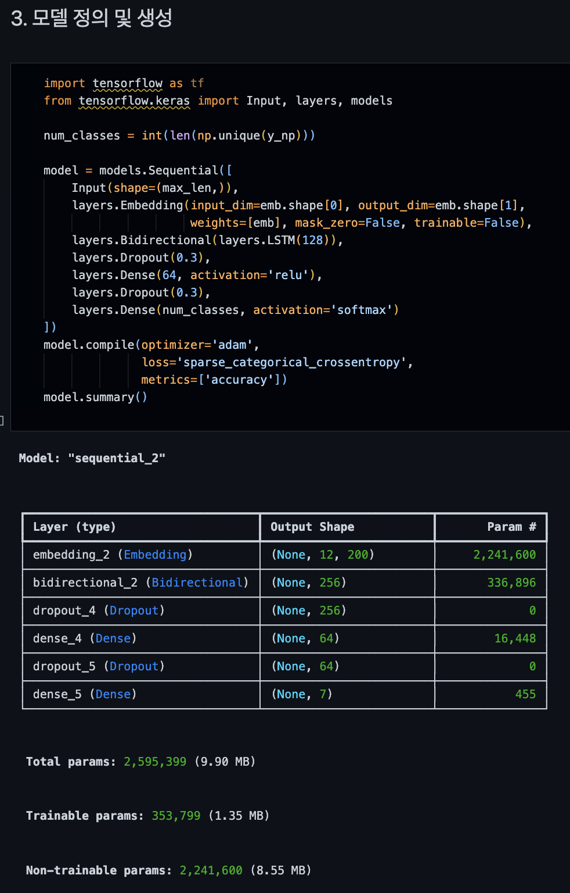
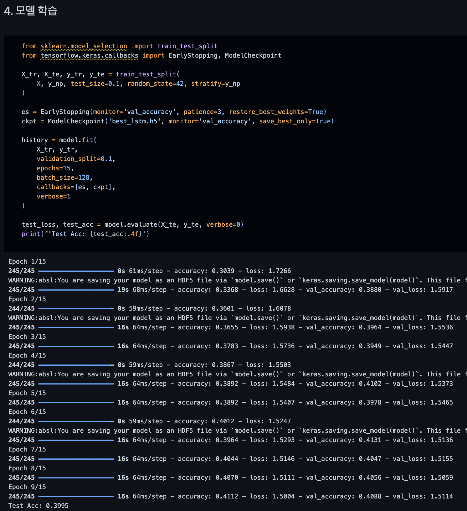
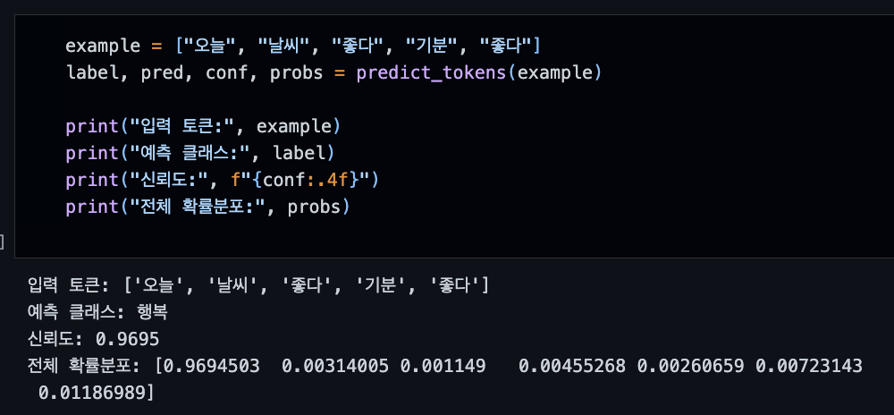
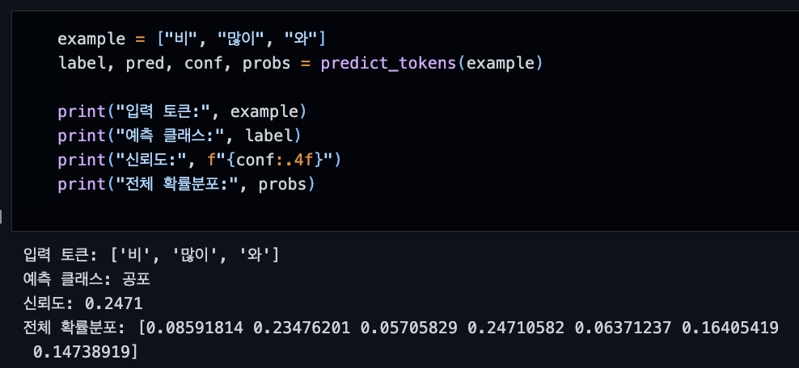
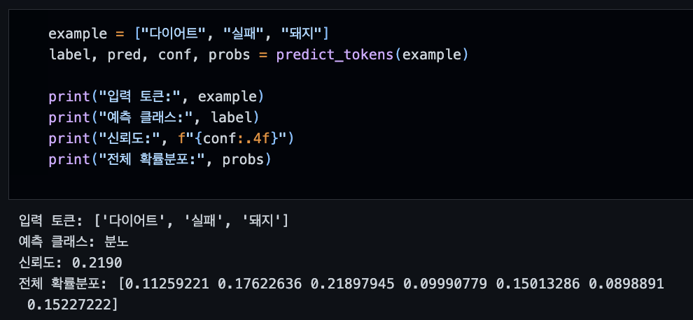

# Emotional Analysis (Korean) — Word2Vec + BiLSTM

한국어 단발성 대화 데이터셋을 이용한 감정 분석 파이프라인입니다.  
**토큰화된 문장(list of str)** → **Word2Vec 임베딩(gensim)** → **BiLSTM 분류기(TensorFlow/Keras)** 흐름으로 구성되어 있습니다.

---

.
├─ emotional-analysis.ipynb       # 전체 파이프라인 노트북
├─ 한국어_단발성_대화_데이터셋.xlsx    # 샘플 데이터
├─ images/                        # 결과 캡처/시각화
└─ README.md

---

🔑 Pipeline
1. 데이터 로드 & 전처리
	•	Sentence: 토큰 리스트(list of str)
	•	Emotion: 정수 라벨(int)

2. Word2Vec 학습
	•	gensim.Word2Vec
	•	권장: vector_size=200, window=5, min_count=2, sg=1, epochs=10

3. 인덱싱 & 패딩
	•	vocab {token: index} (0=PAD, UNK=len(vocab)+1)
	•	pad_sequences(..., padding='post', value=0)
	•	max_len은 문장 길이의 95~99 분위 추천

4. 임베딩 매트릭스
	•	Word2Vec → numpy matrix
	•	UNK는 평균 벡터 또는 0 초기화

5. 모델 정의 (BiLSTM)
	•	Embedding(weights=[emb], trainable=False)
	•	Bidirectional(LSTM(128))
	•	Dense(64, relu) → Dense(num_classes, softmax)
	•	Loss: sparse_categorical_crossentropy
	•	Optimizer: adam

6. 학습/검증
	•	train_test_split(..., stratify=y)
	•	EarlyStopping(monitor='val_accuracy', patience=3, restore_best_weights=True)
	•	필요 시 class_weight 적용

7. 추론
	•	입력: 토큰 리스트
	•	출력: (pred_label, confidence, prob_distribution)

---

💻 코드 스니펫

## 1) 데이터 로드

간단 요약:
- `Sentence`: 토큰 리스트(list[str])
- `Emotion`: 정수 라벨(int)

---

## 2) 데이터 전처리

핵심:
- 결측치 제거
- 길이/라벨 분포 확인
- (선택) 이상치/중복 제거

---

## 3) 모델 정의 및 생성

구성:
- `Embedding(weights=[Word2Vec], trainable=False)`
- `Bidirectional(LSTM(128))`
- `Dense(64, relu) → Dense(num_classes, softmax)`

---

## 4) 모델 학습

설정:
- `validation_split=0.1`
- `EarlyStopping(patience=3, restore_best_weights=True)`
- (선택) `class_weight`로 불균형 보정

---

## 5) 추론1

---

## 6) 추론2

---

## 7) 추론3

---

🙏 Acknowledgements
	•	Dataset: 한국어 단발성 대화 데이터셋 (https://aihub.or.kr/)
